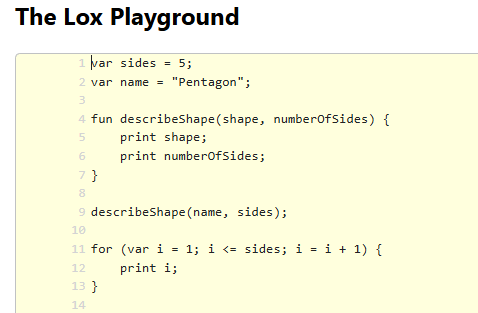
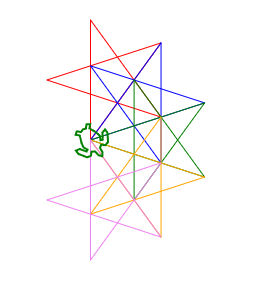

# COMP3000 Development Log

This log records my weekly learning, workshop activities, and progress towards
Assignment 1.

## Week 1 - Team Based Learning

**Logbook entry date:** 28 July 2026

### Before the workshop

I reviewed the Team Based Learning (TBL) overview and learned how the weekly
preparation, readiness tests, and team activities would work.

### During the workshop

I completed iRAT 1 and participated in the team activities. We also worked on
our team contract, where we discussed expectations and how we would work
together throughout the semester.

### After the workshop

There was no major Assignment 1 development this week. My focus was on
understanding the unit structure and the team-based workshop process.

### What I learned

I understood how the TBL process would work and what was expected from me
before and during future workshops.

## Week 2 - Compiling and Interpreting Material

**Logbook entry date:** 4 August 2026

### Before the workshop

I attended the Week 2 lecture and read Chapters 1 and 2 of *Crafting
Interpreters*. I reviewed little languages, the compiler/interpreter pipeline,
and the difference between compilers and interpreters.

### During the workshop

I completed iRAT 2 and worked with my team using Regexr to experiment with
regular expressions. We tried exact matches, alternatives, repeated patterns,
and capture groups on sample text.

We also explored extracting particular words from dialogue and discussed
whether regular expressions are a complete language. We identified features
such as capture groups for storing matched values and repetition using `*` and
`+`, but found that ordinary regex does not provide the same general control
flow as a general-purpose programming language.

### After the workshop

I reviewed how the compiler/interpreter pipeline connects to the assignment.
In particular, I understood that the scanner converts source code into tokens
and the parser later turns those tokens into a structured tree.

### What I learned

I learned that a language can be small and specialised for one domain. This
later helped me think about designing a domain-specific language for river
systems.

## Week 3 - Lox

**Logbook entry date:** 11 August 2026

### Before the workshop

I attended the Week 3 lecture, read Chapter 3 of *Crafting Interpreters*, and
experimented with Lox before the workshop. I prepared for the iRAT and tRAT by
reviewing Lox features such as expressions, variables, functions, and classes.

### During the workshop

I completed iRAT 3 and participated in the tRAT with my team. I experimented
with Lox in the online playground by writing and running small programs using
variables, functions, loops, and output.

For the application exercise, I used Lox to generate Logo turtle-graphics
commands. I created my own geometric star design, compared it with my
teammates' work and other workshop designs, and presented my result to the
class.

### After the workshop

I continued experimenting with Lox and reviewed how a program can generate
another program. This helped me become more familiar with Lox syntax before
starting the scanner and parser implementation in later weeks.

### What I learned

I became more comfortable writing Lox programs and understood how loops and
functions can generate repeated output instead of manually writing every
command.

## Week 4 - Scanning

**Logbook entry date:** 18 August 2026

### Before the workshop

I attended the Week 4 lecture and read Chapter 4 of *Crafting Interpreters*. I
studied how a scanner converts source characters into tokens, including lexical
errors and lookahead, and prepared for the iRAT and tRAT.

### During the workshop

I completed iRAT 4 and participated in the tRAT. My team then started designing
the language for Assignment 1, focusing on how water flow over several days
could be represented as a literal.

Our initial idea was to keep the literal simple by using a sequence of daily
flow values, for example:

`[10, 8, 6, 4, 2]`

During the reporting period, I compared our idea with other teams. One design I
remember conceptually used explicit day/value pairs, similar to:

`flow{1:10, 2:8, 3:6, 4:4, 5:2}`

I thought this was more elegant because the day associated with each flow value
was immediately visible instead of being determined only by its position in a
list. This made me think more carefully about making the meaning of a
domain-specific literal visible in its syntax.

### After the workshop

I continued working through the Chapter 4 Lox scanner and practised how source
code is converted into tokens. I also started thinking about which keywords and
symbols a river-specific language would require.

### What I learned

I learned how scanning turns characters into tokens and how language-design
decisions affect the scanner. The workshop also showed me that a literal can be
designed to communicate both its value and its domain-specific meaning clearly.

## Week 5 - Representing Code

**Logbook entry date:** 25 August 2026

### Before the workshop

I attended the Week 5 lecture, read Chapter 5 of *Crafting Interpreters*, and
followed the AST implementation in my own Lox project. I prepared for the iRAT
and tRAT by reviewing expression trees, context-free grammars, and how
evaluation can be viewed as tree traversal.

### During the workshop

I completed iRAT 5 and participated in the tRAT. My team worked on representing
river systems as expression trees. We experimented with using `+` to show two
river flows combining and discussed how grouping changes the topology.

For example:

`A + (B + C)`

and

`(A + B) + C`

contain the same three rivers but produce different tree structures. This was
important because the tree can represent which rivers combine first.

We also started describing our river syntax using Nystrom-style grammar and
discussed how the tree could later be evaluated to calculate downstream flow.

### After the workshop

I continued the Chapter 5 exercises by converting between expressions and
trees and practising context-free grammar. I also worked with `GenerateAst`
and `AstPrinter` in my Lox implementation so I could see the generated AST
structure.

This work later influenced my Assignment 1 decision to use `<>` as a dedicated
river-confluence operator instead of ordinary `+`.

### What I learned

I learned that an AST represents the structure and meaning of an expression,
not just its tokens. This made me realise that grouping and operator choice are
important when the tree represents a physical river network.

## Week 6 - Parsing

**Logbook entry date:** 1 September 2026

### Before the workshop

I attended the Week 6 lecture and read Chapter 6 of *Crafting Interpreters*. I
reviewed recursive descent parsing, ambiguous grammars, precedence and
associativity, and prepared for the iRAT and tRAT.

### During the workshop

I completed iRAT 6 and participated in the tRAT. We worked on turning our
river-language ideas from the previous week into grammar rules that could later
be implemented in Java.

One water-flow example I worked through was:

`flow[10, 7, 3]`

I represented its structure with a grammar rule similar to:

`flowLiteral -> "flow" "[" NUMBER ( "," NUMBER )* "]" ;`

I then worked through how a parser could recognise `flow`, consume the opening
bracket, read the numbers separated by commas, and finally consume the closing
bracket. We also discussed checking the grammar for ambiguity before
implementing it.

### After the workshop

I continued working with the Chapter 6 Lox parser and practised how grammar
rules translate into recursive descent methods in Java.

This became the foundation for my Assignment 1 parser. I later extended the
same approach to support my own `flow[...]` syntax, river declarations,
confluences, grouped confluences, and the final `outlet` statement.

### What I learned

I understood how the main stages of the language now connect:

`source -> tokens -> parser -> AST`

The most important thing I learned was that the grammar directly guides the
structure of the parser. Each grammar rule can be translated into parser logic
that consumes the expected tokens and builds the corresponding AST nodes.

## Week 7 - Evaluating Expressions

**Logbook entry date:** 8 September 2026

### Before the workshop

I attended the Week 7 lecture and read Chapter 7 of *Crafting Interpreters*. I
reviewed the difference between expressions and values and learned how the
Visitor pattern can be used to evaluate an AST by walking through its nodes.

### During the workshop

I completed iRAT 7 and participated in the tRAT. My team discussed how the
river expressions we had designed in previous weeks could actually be
evaluated.

For example, we considered a simple combination such as:

`RiverA + RiverB`

and traced its tree:

- evaluate `RiverA`
- evaluate `RiverB`
- combine the two resulting flow values
- return the combined downstream flow

We also discussed where rainfall data should come from. For our workshop
design, we considered keeping a small rainfall history directly in the
evaluator because it made testing the tree-walking process easier.

### After the workshop

I continued working through the Chapter 7 interpreter and practised tracing
evaluation through AST nodes. I also reviewed runtime errors and why evaluation
uses recursive Visitor calls.

This helped me understand the next stage of my RiverFlow language: the parser
creates the river-network structure, while an evaluator could later walk that
structure to calculate actual downstream flows.

### What I learned

I learned the difference between an expression and its resulting value. For
example, `1 + 2` is an expression, while `3` is the value obtained after
evaluating it.

I also understood the overall pipeline more clearly:

`source -> tokens -> AST -> evaluation -> value`

## Week 8 - Statements Part One

**Logbook entry date:** 15 September 2026

### Before the workshop

I attended the Week 8 lecture and read Sections 8.1 and 8.2 of Chapter 8 of
*Crafting Interpreters*. I reviewed how Lox moves from an expression-only
language to a language containing statements.

I also prepared my Assignment 1 progress for the optional Week 8 presentation.

### During the workshop

I completed iRAT 8 and participated in the tRAT. We worked with statements,
including expression statements, print statements and variable declarations.

One example I worked through was:

`var x = 3;`

`print x;`

This helped me distinguish between declaring a variable and later using that
variable inside an expression.

I also discussed how adding a new statement affects several parts of an
interpreter, including the grammar, parser, generated AST and Visitor methods.

### Assignment 1 Showcase

For the optional Assignment 1 presentation, I submitted
`RiverFlow Week 8.pdf` and presented my current RiverFlow language design.

I explained my current thinking about representing river responses, combining
upstream rivers, and how the source code would be converted into an AST.

I also took notes on other presentations during the showcase. One presentation
used a peak-day approach for modelling river flow. Instead of representing
every day of the response separately, the design identified when the flow
reached its peak. I found this interesting because my RiverFlow design at this
stage was still based on representing flow over a 10-day period.

Another presentation showed how multiple rivers could combine progressively.
Smaller rivers could first combine into one river, and that resulting river
could then join another river before eventually flowing into the main
downstream river. I liked this approach because it naturally represented a
river network as a tree.

### Technique I Would Consider

The peak-day approach was a technique that I wanted to consider for my own
language. It provided a more compact way of describing the important shape of
a river response instead of explicitly representing all ten days.

I later incorporated this idea into RiverFlow. My final flow syntax represents
a starting flow, peak flow, peak day and recession factor. For example:

`flow[3 -> 20 @ 4 ~ 0.6]`

### Reflection on My Own Work

At this stage, I felt that the overall RiverFlow idea was progressing well. I
had a clear problem domain and was starting to connect the language design to
scanning, ASTs and parsing. I also had an approach for representing how
different rivers connect to form a larger river network.

The main area that still needed attention before Assignment 1 was the flow
representation. My existing 10-day approach worked, but it was more detailed
than necessary and I wanted a clearer and more compact representation.

The showcase gave me another way to think about this problem. After further
development, I replaced the 10-day representation with the peak-day-based
design used in my final Assignment 1 language.

### After the workshop

I continued developing Assignment 1 using the Lox codebase. Another important
idea from this week was that RiverFlow should not only contain expressions.

A river declaration describes a river and its response, while an outlet
identifies the final river of the network. This influenced my later use of
statement nodes such as `Stmt.River` and `Stmt.Outlet`, while flow and
confluence structures are represented as expressions.

### What I Learned

I learned that expressions produce values, while statements describe actions
or larger pieces of program structure.

This distinction became important in my RiverFlow design:

- `flow[...]` and river confluences are expressions.
- `river ... { ... }` and `outlet ...;` are statements.

I also learned from the Assignment 1 showcase that seeing other approaches can
help identify weaknesses in my own design. In particular, the peak-day idea
helped me rethink my original 10-day flow representation, while the progressive
river-combination approach reinforced how useful a tree structure is for
representing a river network.

These ideas helped give my final RiverFlow language a clearer and more compact
structure.

### After the workshop

I continued developing Assignment 1 using the Lox codebase. An important idea
from this week was that RiverFlow should not only contain expressions.

A river declaration describes a river and its response, while an outlet
identifies the final river of the network. This influenced my later use of
statement nodes such as `Stmt.River` and `Stmt.Outlet`, while flow and
confluence structures are represented as expressions.

### What I learned

I learned that expressions produce values, while statements describe actions
or larger pieces of program structure.

This distinction became important in my RiverFlow design:

- `flow[...]` and river confluences are expressions.
- `river ... { ... }` and `outlet ...;` are statements.

This gave my language a clearer structure than representing the entire river
system as one large expression.

---

## Learning Log - To Be Continued

This learning log currently records my progress through Week 8.

I will continue adding weekly entries as I complete the remaining COMP3000
workshops, readings, exercises, and Assignment 2 development.